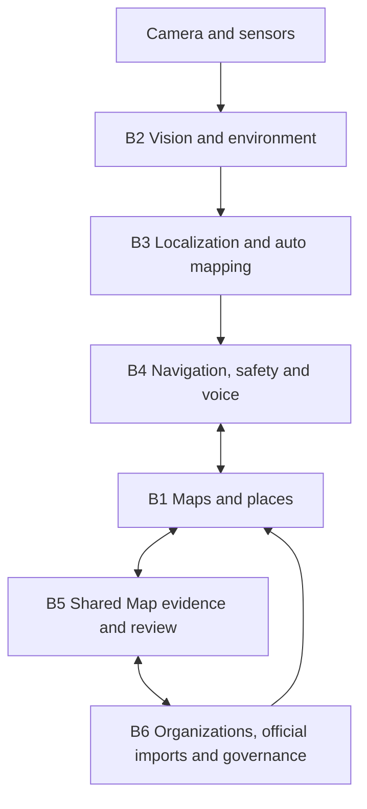

# Basira navigation system — B1 to B6

**Engineering state:** software validation in progress. Not field safe and not validated for independent blind navigation. Use only as an assistive prototype in controlled, supervised field validation after the gates in [the field plan](field-validation-plan.md).

## Data and trust boundaries

- **B1** stores public buildings, floors, places, and a routable node/edge graph. SavedPlace is user owned; read, update and delete routes filter by `user_id`. Private saved places are not public map contributions without explicit opt-in.
- **B2** requests camera access when the user starts vision. Object detection, semantic segmentation, OCR, and relative depth are browser dependent. No camera stream or frame is persisted by the navigation flow. Depth Anything is relative, not metres. Drop-off detection, stair direction, metric depth, native AR localization, and unknown obstacle classes are centrally disabled unless explicitly enabled by server flags.
- **B3** combines anchors and motion into a confidence estimate. Raw tracks, anchors and floor events are deleted when a mapping session is finalized; startup cleanup cancels abandoned sessions older than seven days and removes closed-session details. Reviewable suggestions remain. A lost or low-confidence estimate stops confident turn instructions and requests a known anchor.
- **B4** plans on B1, voices instructions, and reacts to obstacles conservatively. An emergency stop cancels guidance, speech/listening, motion, vibration and camera resources for the active session. It does not guarantee detection of every obstacle.
- **B5** keeps community observations and corroboration separate from the official graph. Independent evidence can reach `COMMUNITY_VERIFIED`, but a scoped reviewer must approve before B1 changes and `MapVersion` advances. Offline opt-in submissions are queued per session; a network interruption does not imply successful delivery.
- **B6** adds organizations, memberships, official map import previews, explicit approval, audit entries and scoped review. A global admin creates organizations and grants organization admins. Organization admins can configure their organization and assign mapper, reviewer or viewer roles; only the global admin changes verification status or grants an organization admin. The backend enforces these boundaries. Existing direct B1 endpoints reject changes to official maps: use reviewed B5 changes or the B6 import flow.

## Official map lifecycle

Organization admin creates or is assigned a building → mapper submits a structured Basira JSON v1 draft → `MapImportValidator` returns errors, warnings and counts → reviewer explicitly approves an assigned building with no existing places, nodes or edges inside a transaction → B1 floors/places/nodes/edges and official metadata are written → `MapVersion` and change log advance → audit event is recorded → B4/B5 clients see the new version. Existing floors can be reused only if their IDs, numbers and names match the draft exactly. Invalid input writes no B1 map. Existing operational maps require a separate human reviewed migration, to avoid silently replacing a graph.

Only **Basira JSON v1** has a parser and transactional import in B6; its schema and example are in [the import guide](official-map-import-b6.md). IMDF, GeoJSON, SVG, PDF, DWG/DXF/CAD, BIM/IFC are not automatically converted. PDF/CAD/BIM are reference material for a mapper until a verified parser and topology review exist. Import is JSON API input, not an arbitrary file upload. The endpoint limits bodies to 1 MB; arrays, IDs, coordinates and graph references have bounded validation. Uploaded files are never executed.

## Offline and resources

The production service worker caches the shell; public B1 graph/floor/place responses for recently used buildings; and static/model assets only when requested. It never caches auth or saved-place APIs. Entries and individual response sizes are capped. Navigation pages are separate JavaScript chunks, and the first page load does not download the large B2 models; camera/model initialization happens after an explicit start. The existing in-session map copy can be stale offline; closure and community sync cannot be trusted until reconnection.

## Privacy and permissions

Permissions are progressive: camera for vision/QR, microphone for optional voice commands, location to suggest a building, motion for step tracking, and NFC/Bluetooth/notifications only on supported paths. The privacy center shows state, reason, optionality and fallback in Arabic, English and Chinese. No face recognition, passive voice recording, or public contributor identity is introduced. Organization audit metadata excludes raw tracks, camera frames and saved places. Production retention/deletion review remains necessary before a field pilot.

## Capability classification

| Category | Capability |
| --- | --- |
| Implemented and automated tested | B1 graph, B3/B4 domain routing, B5 corroboration/promotion, B6 role policy, import validation, simulated cross-stage route, privacy route boundary, limited SQL migration orchestration. |
| Browser dependent | Camera, TTS/STT, motion, vibration, service worker, Web NFC/Bluetooth availability, OCR, segmentation. UI feature detection does not prove runtime accuracy. |
| Native only / interface only | ARKit/LiDAR, ARCore Depth, BLE beacons, Wi-Fi RTT, native AR localization. |
| Experimental | Obstacle classes, drop-off and stair direction inference, metric depth from a native bridge. Centrally off by default. |
| Not field validated | Real building localization error, route reliability for blind participants, obstacle recall, phone performance, thermal/battery impact. |
| Future work | Verified IMDF/GeoJSON conversion, reference file workflow, live MySQL fresh/upgrade rehearsal, browser/phone matrix, accessibility audit with assistive technology. |

## Validation limits

`server/b6.simulatedE2E.test.ts` is a **simulated automated E2E** with fake vision, anchors, and OCR evidence. It is not a camera/browser/phone test. The migration tests use a simulated SQL connection; no MySQL instance was available during this task. The health liveness route is distinct from readiness: `/api/readiness` requires DB, auth table and B1 map table; optional models are reported as degraded separately.
